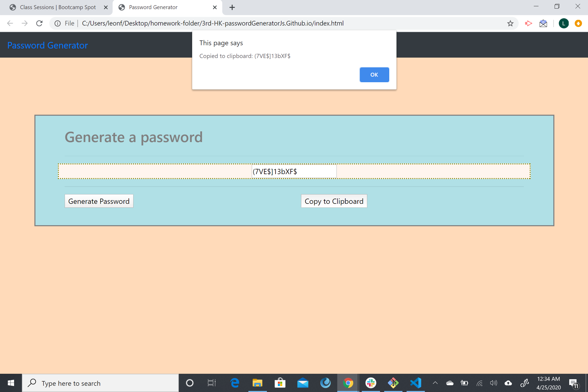

# passwordGeneratorJs.Github.io

## Web page about generating random passwords.

THis is my first Javasript webpage (assignment) where I used an html, css and a javascript files to create a page where  random passwords can be generated by user input criterias.

---

### Contributors

Leon Carnagie <leonfross@gmail.com>

---

#### License & copyright

Carnagie.com UC Berkeley

Click the link below

[Carnagie.com](https://github.com/Leon0917/Leon-First-Website.github.io)
